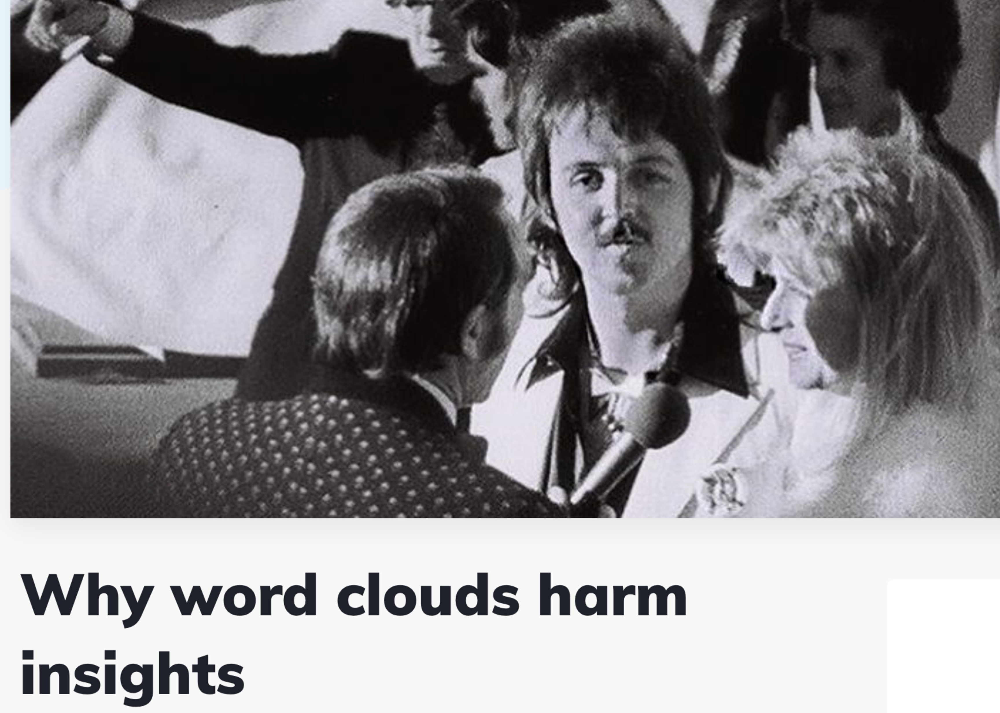

class: center, middle

```{r setup, include=FALSE}
options(htmltools.dir.version = FALSE)
knitr::opts_chunk$set(
  fig.width=9, fig.height=3.5, fig.retina=3,
  out.width = "100%",
  cache = FALSE,
  echo = TRUE,
  message = FALSE, 
  warning = FALSE,
  hiline = TRUE
)
```

```{r xaringan-tile-view, echo=FALSE}
xaringanExtra::use_tile_view()
```

```{r xaringan-themer, include=FALSE, warning=FALSE}
library(xaringanthemer)
style_duo_accent(
  primary_color = "#1381B0",
  secondary_color = "#FF961C",
  inverse_header_color = "#FFFFFF",
  title_slide_background_image = "key.png",
  header_font_google = google_font("Josefin Sans", "600"),
  text_font_google   = google_font("Josefin Sans", "300", "300i"),
  code_font_google   = google_font("Fira Mono"),
  text_font_size = '1.9em',
  code_font_size = '0.7em'
)
```

```{r xaringanExtra, echo=FALSE}
xaringanExtra::use_xaringan_extra(c("tile_view", "animate_css", "tachyons"))
```


## Outline

Word frequencies<br />
Stopwords<br />
Word clouds<br />
Keywords

---
class: inverse, center, middle

# Word frequencies

---
class: middle

## Word frequencies

Basic assumption: more frequent words are more "important"; more representative of a corpus's style/content/cognitive style

---
class:middle

## Get the top-20 most frequent words in your corpus

```{r include=FALSE}
library(pacman)
p_load(rio, tidyverse, tidytext, textreadr, flextable)
corpus <- read_dir("data") %>% 
  rename(doc_id = document, 
         text = content) %>% 
  as_tibble()
```

First, tokenize your corpus using unnest_tokens() from {tidytext}.

```{r}
corpus_tokens <- 
  corpus %>% 
  unnest_tokens(word, text)
```

---

```{r xaringan-panelset, echo=FALSE}
xaringanExtra::use_panelset()
```

## Count word forms

Now, use count() to get the frequencies of unique word forms.

.panelset[
.panel[.panel-name[Code]

```{r panel-chunk, eval=F}
top20 <- 
  corpus_tokens %>% 
  count(word, sort = T) %>% 
  slice_max(n, n=20)

top20 
```

]

.panel[.panel-name[Output]

]
]

---

## Observation

Practically all words in the top-20 are function words (i.e. grammatical words), with two exceptions: *said* and *have*.

--

But that finding is nearly useless: any other corpus of English would look pretty much identical!

---
class: middle

.pull-left[
This is where it makes sense to remove **stop words** from the corpus: a predefined list of high-frequency function words. {tidytext}  contains a tibble of stop words that we can use for this purpose. It is called stop_words.]

.pull-right[

```{r echo=F}
stop_words 
```
]

---

## Removing stop words from a corpus

Because stop_words has a column with the same name as one of the columns in our corpus--the column **words** - we can easily remove all stop words using anti_join(). 

> Please read up on the *join* group of commands -  anti_join(), left_join(), etc. -  [here](https://dplyr.tidyverse.org/reference/mutate-joins.html) and [here](https://dplyr.tidyverse.org/reference/filter-joins.html).

```{r}
corpus_tokens <- 
  corpus_tokens %>% 
  anti_join(stop_words)
```

---
class:middle

By dropping the stop words in our corpus, we've just lost a little more than half of our corpus size, but that's okay. At least we now know that the remaining words are actually interesting! 

Let's run the top-20 analysis again.

---

## Top-20 after stopword removal

.panelset[
.panel[.panel-name[Code]

```{r panel-chunk2, eval=F}
top20 <- 
  corpus_tokens %>% 
  count(word, sort = T) %>% 
  slice_max(n, n=20)

top20 
```

]

.panel[.panel-name[Output]

]
]

---

## Observation

.pull-left[
Much better! This gives us an idea of what's going on in our corpus - at least of what some of the dominant topics are.

But still not perfect. What else remains in the list that is not helpful? 
]

.pull-right[


]


---
class: middle, center
```{r xaringan-scribble, echo=FALSE}
xaringanExtra::use_scribble()
```


---

## Plan of action

We should

- write our own custom list of words to exclude in addition to the stop words (e.g. *it's*, which should have been dropped via stop word removal, but wasn't),
- find a way to handle different inflected forms of the same word (e.g. *time/times*),
- think about whether we want to conflate pairs of synonyms (e.g. *doctor* and *doc*).

---

## Write a custom "blacklist" of words 

We'll write a simple vector of words we want to exclude. Since a vector is not a tibble (or data frame), we can't use anti_join() to remove those words from the corpus_tokens object. But we can use filter() to achieve the same thing.

```{r}
my_excl <- 
  c("it’s", "time")

corpus_tokens <- 
  corpus_tokens %>% 
  filter(!word %in% my_excl)
```

---

## Dealing with typographic punctuation

The reason why we still had "it's" in the corpus (even after stop word removal) is because there were typographic apostrophes in there. And the stop_words list only knows straight apostrophes. 

Let us replace one with the other, i.e. all typographic apostrophes will be replaced by straight ones: out with ’ and in with '. **We'll use another function from {stringr} for this: str_replace_all().**

```{r}
corpus_tokens <- 
  corpus_tokens %>% 
  mutate(word = str_replace_all(word, "’", "'"))
```

---

## Different forms of the same word

e.g. *time/times*

possible remedies: stemming vs. lemmatizing

Either one of the procedures above would help here, but lemmatization is clearly better. We will discuss it in an upcoming class session when we talk about *annotation*.

---
class:middle

## Synonyms

If it is important to the analysis, then we may sometimes want to map several synonyms onto one term. Simply for practice, let's say we want to consolidate variation among different terms for the current pandemic: in our corpus we encounter *coronavirus, covid*, and *pandemic*, but let's pretend we want them all to be replaced by one term, *covid-19.* 

This will give us one term in the top-20 list with a much higher hit number than if we kept the three terms separate.

---
class:middle

Using the str_replace_all() function, here is how to search for several options and replace with just one string.

```{r}
corpus_tokens <- 
  corpus_tokens %>% 
  mutate(word = 
           str_replace_all(word,
                           "pandemic|covid|coronavirus",
                           "covid-19"))
```

---
class: middle

When we finally re-run the top-20 analysis, here is what we get.

---

.pull-left[
```{r echo=F}
pacman::p_load(kableExtra)
corpus_tokens %>%
  count(word, sort = T) %>% 
  mutate(rank = row_number()) %>% 
  select(rank, everything()) %>% 
  slice(1:10) %>% 
  kbl() %>% kable_paper()
```

]

.pull-right[

```{r echo=F}
corpus_tokens %>% 
  mutate(rank = row_number()) %>% 
  select(rank, everything()) %>% 
  count(word, sort = T) %>% 
  mutate(rank = row_number()) %>% 
  select(rank, everything()) %>% 
  slice(11:20) %>% 
  kbl() %>% kable_paper()
```
]

---

class: middle, center, inverse

# Word clouds

---

## Nobody loves word clouds

.pull-left[
Word clouds have an exceptionally bad reputation among NLP practitioners, digital text analysts, data scientists, computational linguists, etc. 

Here are some quotes from data-sciencey articles about word clouds:
]

.pull-right[

- "Word clouds are the pie chart of text data"
- "Word clouds considered harmful"
- "Word clouds are the mullets of the internet"

.center[]

]

---
class: middle, center

## I don't really have a counterargument, but...

---

## Let's make one anyway

We will need to p_load() two packages.

```{r}
p_load(wordcloud, wordcloud2)
```

Wordclouds are made from exactly the kind of frequency counts that we've produced above: one column of words and another column of frequencies. Only our top-20 would not be quite enough words to fill a "cloud". 

---
## Create data object to draw the cloud from

.pull-left[
We'll run code similar to the one above, counting word frequencies, but retain the top-80 instead of the top-20 terms.

```{r}
top80 <- 
  corpus_tokens %>% 
  count(word, sort = T) %>% 
  slice(1:80)
```
]

.pull-right[
```{r echo=F}

top80 %>% 
  as_tibble() 

```
]


---
class: middle, center, inverse

# KWIC

---

## Keywords in context

---

