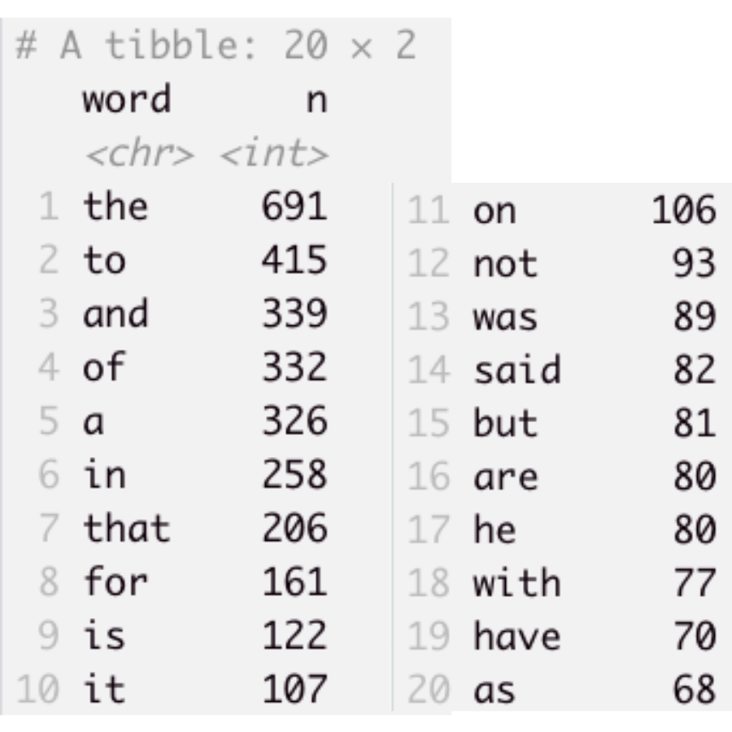
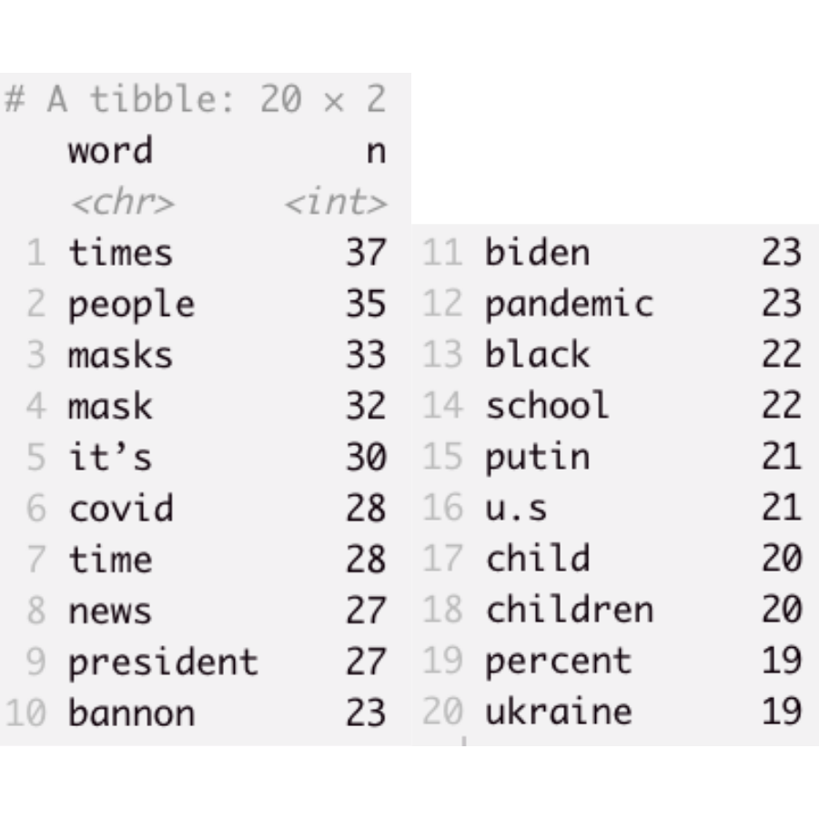

class: center, middle

```{r setup, include=FALSE}
options(htmltools.dir.version = FALSE)
knitr::opts_chunk$set(
  fig.width=9, fig.height=3.5, fig.retina=3,
  out.width = "100%",
  cache = FALSE,
  echo = TRUE,
  message = FALSE, 
  warning = FALSE,
  hiline = TRUE
)
```

```{r xaringan-themer, include=FALSE, warning=FALSE}
library(xaringanthemer)
style_duo_accent(
  primary_color = "#1381B0",
  secondary_color = "#FF961C",
  inverse_header_color = "#FFFFFF",
  title_slide_background_image = "key.png",
  header_font_google = google_font("Josefin Sans", "600"),
  text_font_google   = google_font("Josefin Sans", "300", "300i"),
  code_font_google   = google_font("Fira Mono"),
  text_font_size = '1.9em',
  code_font_size = '0.7em'
)
```

```{r xaringanExtra, echo=FALSE}
xaringanExtra::use_xaringan_extra(c("tile_view", "animate_css", "tachyons"))
```


## Outline

Word frequencies<br />
Stopwords<br />
Word clouds<br />
Keywords

---
class: inverse, center, middle

# Word frequencies

---
class: middle

## Word frequencies

Basic assumption: more frequent words are more important and representative of a corpus's style/content/cognitive style
---
class:middle

## Get the top-20 most frequent words in your corpus

```{r include=FALSE}
pacman::p_load(rio, tidyverse, tidytext, textreadr, flextable)
corpus <- read_dir("data") %>% 
  rename(doc_id = document, 
         text = content) %>% 
  as_tibble()
```

First, tokenize your corpus using unnest_tokens() from {tidytext}.

```{r}
corpus_tokens <- 
  corpus %>% 
  unnest_tokens(word, text)
```

---

```{r xaringan-panelset, echo=FALSE}
xaringanExtra::use_panelset()
```

## Count word forms

Now, use count() to get the frequencies of unique word forms.

.panelset[
.panel[.panel-name[Code]

```{r panel-chunk, eval=F}
top20 <- 
  corpus_tokens %>% 
  count(word, sort = T) %>% 
  slice_max(n, n=20)

top20 
```

]

.panel[.panel-name[Output]

]
]

---
class:middle

## Observation

Practically all words in the top-20 are function words (i.e. grammatical words), with two exceptions: *said* and *have*.

--

This analysis is nearly useless: any other corpus of English would look pretty much identical!

---
class: middle

.pull-left[
This is where it makes sense to remove **stop words** from the corpus: a predefined list of high-frequency function words. {tidytext}  contains a tibble of stop words that we can use for this purpose. It is called `stop_words`.]

.pull-right[

```{r echo=F}
stop_words 
```
]

---

### Removing stop words from a corpus

Because stop_words has a column with the same name as one of the columns in our corpus--the column **words**--we can easily remove all stop words using anti_join().

```{r}
corpus_tokens <- 
  corpus_tokens %>% 
  anti_join(stop_words)
```

We've just lost a little more than half of our corpus size, but that's okay. Let's run the top-20 analysis again.

---

## Top-20 after stopword removal

.panelset[
.panel[.panel-name[Code]

```{r panel-chunk2, eval=F}
top20 <- 
  corpus_tokens %>% 
  count(word, sort = T) %>% 
  slice_max(n, n=20)

top20 
```

]

.panel[.panel-name[Output]

]
]

---

## Much better!

.pull-left[
This gives us a much better idea of what's going on in our corpus--at least what some of the dominant topics are.

But still not perfect. What else would we want to exclude? 
]

.pull-right[


]


---
class: middle, center
```{r xaringan-scribble, echo=FALSE}
xaringanExtra::use_scribble()
```


---

